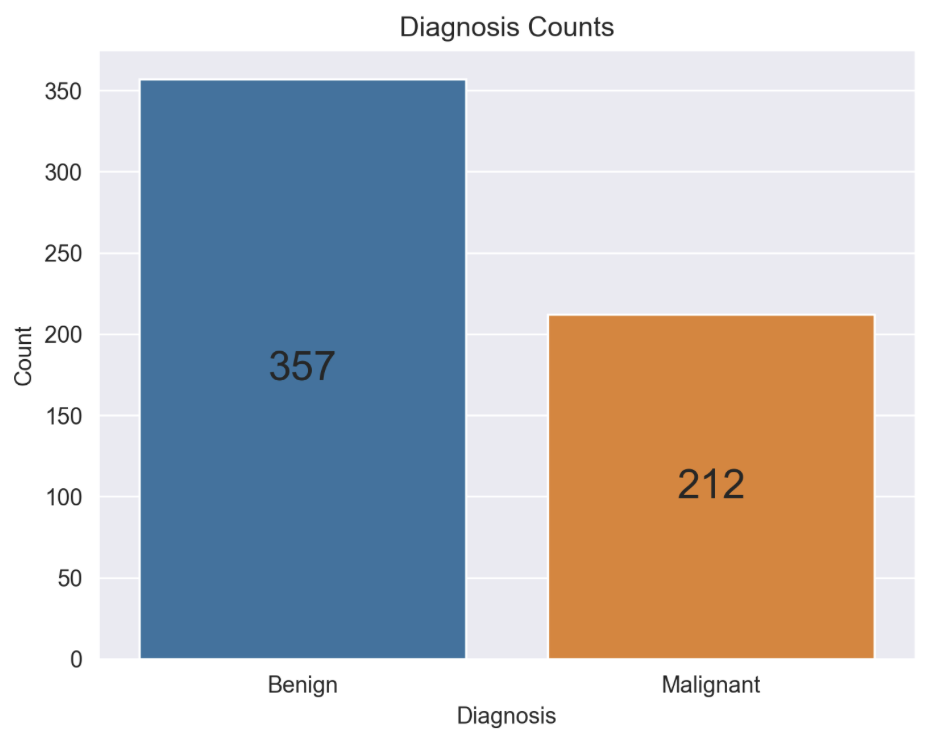
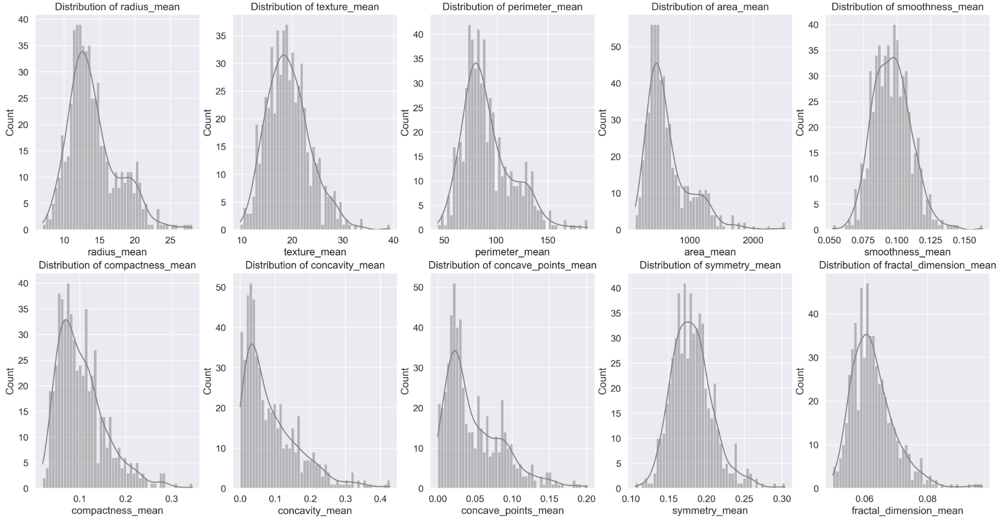
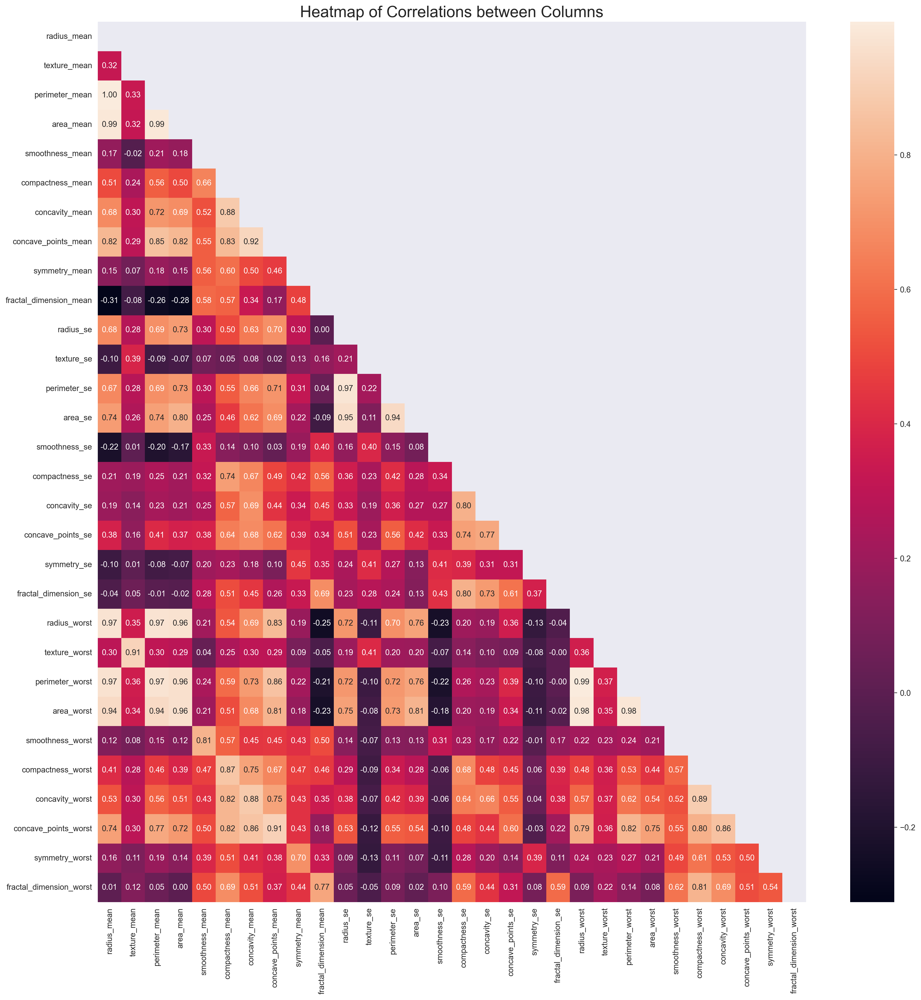
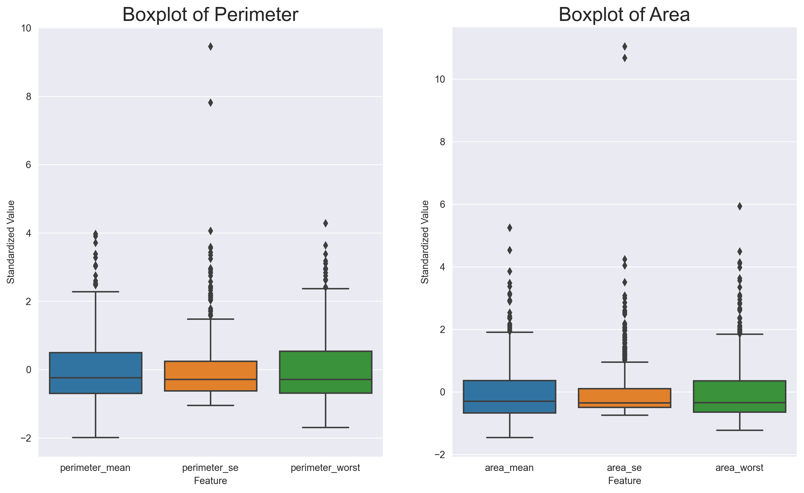
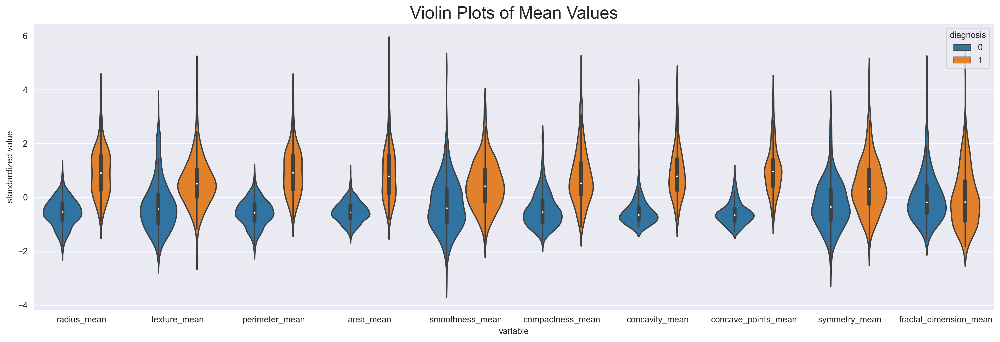
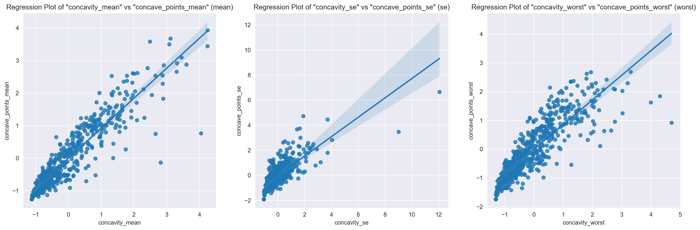

# Group 24 - Breast Cancer Diagnosis in the State of Wisconsin

## Introduction

A common and deadly disease, breast cancer affects countless people worldwide. Early detection of breast cancer is essential for successful treatment and a better prognosis. Our project examines and demonstrates the relationships between particular breast tumour characteristics and whether they are classified as malignant or benign. We hope to understand better the factors affecting benign or malignant tumour growth by identifying the most important ones. We're passionate about this topic because we want to improve early detection and look into how our findings might affect clinical decision-making. Ultimately, we hope patients, healthcare workers, and the medical community will significantly benefit from our efforts better to understand the connections between tumour traits and diagnosis.

### Team Members:
- Mithish Ravisankar Geetha
- Yash Kumar
- Rajveer Sodhi

## Exploratory Data Analysis

1. Our dataset contained many more benign cases than malignant ones, as illustrated by the count plot below.
   
2. The histograms below highlighted that most variables display a right-skewed distribution. This observation implies that more data points are clustered towards the lower end of the range for these variables. In contrast, fewer data points extend toward the higher values. Notably, the 'symmetry_mean' variable is an exception, as it resembles a normal distribution, signifying a more evenly distributed set of data points around the average value.
   
3. Upon examining the heatmap, it became clear that several variables displayed high correlation values equal to or greater than 0.75. Apart from the apparent strong correlation between the 'perimeter' and 'area' variables, it's also important to highlight the significant relationship shared by the 'compactness,' 'concavity,' and 'concave points' variables. These high correlations suggested these features will likely change in tandem.
   
4. The below box plots indicated a couple of things. First, the 'mean' values are more dispersed than the 'se' and 'worst' values, implying that the 'mean' values have a more significant variation and aren't tightly clustered around a single number. Second, the 'perimeter' and 'area' values show a substantial spread, meaning they don't center around a particular value.
   
5. As indicated above, there is a considerable variation in the values of 'perimeter' and 'area.' It's essential to recognize that this variation mainly occurs in malignant cases. In contrast, benign cases concentrate on a particular value.\
   This trend is consistent across all features studied. In each case, malignant diagnoses display a more comprehensive range of values when compared to benign diagnoses.
   
6. The regression plot below indicated that, in contrast to the 'mean' and 'worst' values, the 'se' values generally cluster around a common value, with just a handful of outliers straying from this trend. Additionally, the 'concave points' and 'concavity' variables demonstrate a high correlation, regardless of the specific statistic applied. The above heatmap further corroborated this substantial relationship, solidifying the close connection between these two variables.
   

## Yash Kumar
### Question 1:

**Which characteristic(s) most closely relate(s) to determining if a breast lump is non-cancerous?**

### Question 2:

**How do the distributions of features vary across different sizes of tumours for malignant cases? More specifically, how does the importance of features vary with the tumour size for malignant diagnoses? Lastly, can we determine a range of values for which there is a high probability of a malignant diagnosis?**

[You can also find the full analysis here, including the code and data](https://github.com/ubco-W2022T2-data301/project-group-group24/blob/main/analysis/analysis3.ipynb).

## Mithish Ravisankar Geetha
### Question 1

**Based on the observations of several key features (for example radius and texture), can we accurately identify whether the tumour being benign or malignant?**

### Question 2

**Are there any outlier values in the dataset? How do they affect our understanding of the relationship between key features and diagnosis?**

[You can also find the full analysis here, including the code and data](https://github.com/ubco-W2022T2-data301/project-group-group24/blob/main/analysis/analysis1.ipynb).

## Rajveer Sodhi
### Question 1

**Out of all the data columns, which features seem to be the most highly correlated with the breast cancer's diagnosis, and can we define an approximate percentage probability of the breast cancer being benign or malignant based only on the values from these features?**

### Question 2

**Are there certain subsets of features that seem to be internally correlated? By extension, can we predict the values of other features in this subset given the value of just one?**

[You can also find the full analysis here, including the code and data](https://github.com/ubco-W2022T2-data301/project-group-group24/blob/main/analysis/analysis2.ipynb).

## Conclusion

FILLER TEXT
